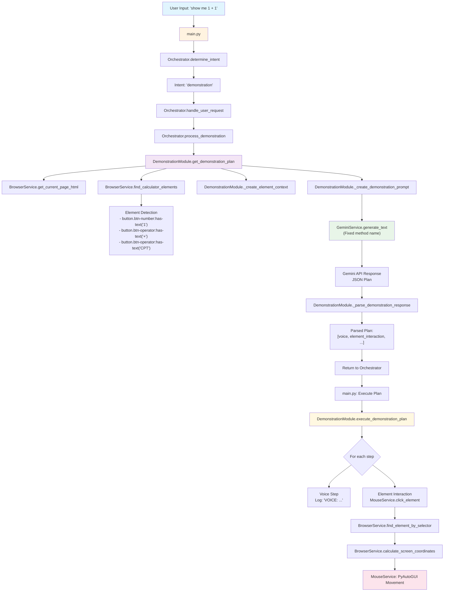

# Demonstration Flow Diagram

This diagram shows the complete flow of how the AI Financial Calculator Assistant handles demonstration requests, from user input to actual mouse movements on the calculator.

## Flow Diagram

## Key Components and Their Roles

### 1. **Entry Point (main.py)**
- Receives user input
- Initializes all services
- Orchestrates the main application loop

### 2. **Orchestrator (core/orchestrator.py)**
- **determine_intent()**: Analyzes user input to detect demonstration vs Q&A
- **process_demonstration()**: Handles demonstration-specific logic
- **handle_user_request()**: Main routing method

### 3. **DemonstrationModule (modules/demonstration_module.py)**
- **get_demonstration_plan()**: Generates step-by-step plans via Gemini
- **execute_demonstration_plan()**: Executes the generated plan
- **_create_element_context()**: Formats available elements for Gemini
- **_create_demonstration_prompt()**: Creates optimized prompts for Gemini

### 4. **BrowserService (services/browser_service.py)**
- **find_calculator_elements()**: Detects specific calculator buttons/elements
- **find_element_by_selector()**: Locates elements using CSS selectors
- **calculate_screen_coordinates()**: Converts element positions to screen coordinates
- **get_current_page_html()**: Retrieves page content for context

### 5. **GeminiService (services/gemini_service.py)**
- **generate_text()**: Sends prompts to Gemini and receives JSON plans
- Handles file context (PDF guidebook) integration
- Manages API communication and response parsing

### 6. **MouseService (services/mouse_service.py)**
- **click_element()**: Performs precise mouse clicks on calculator elements
- **type_text()**: Types text using PyAutoGUI
- Integrates with BrowserService for coordinate calculation

## Data Flow

1. **User Input** → Orchestrator analyzes intent
2. **HTML Context** → BrowserService extracts current page state
3. **Element Detection** → BrowserService finds available calculator buttons
4. **Gemini Planning** → DemonstrationModule creates prompts and gets AI-generated plans
5. **Plan Execution** → MouseService performs actual mouse movements and clicks
6. **Visual Feedback** → User sees smooth cursor movements on the calculator

## Recent Fixes Applied

- ✅ **Method Name**: Fixed `generate_text_content()` → `generate_text()`
- ✅ **Element Selectors**: Updated to specific CSS classes to avoid conflicts
- ✅ **Prompt Instructions**: Enhanced Gemini prompts with precise selector patterns
- ✅ **Error Handling**: Improved element detection and coordinate calculation

## Usage Examples

**Supported Commands:**
- `"show me 1 + 1"`
- `"calculate 2 + 3"`
- `"demonstrate NPV calculation"`
- `"show me how to clear the calculator"`

This diagram serves as a reference for understanding the complete demonstration flow and troubleshooting any issues that arise during development or testing. 